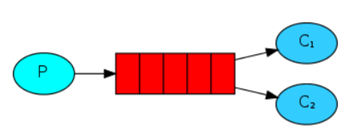

# Architecture

# Specifications
This is a program to send and receive messages from a named queue. In this one we'll create a Work Queue that will be used to distribute time-consuming tasks among multiple workers.\
 
By default, RabbitMQ will send each message to the next consumer, in sequence. On average every consumer will get the same number of messages. This way of distributing messages is called round-robin. Try this out with three or more workers.

` Worker 1 `  
` => Waiting for messages. To exit press CTRL+C`  
` => Received First message`  
` => Received Third message...`  
` => Received Fifth message.....`  

` Worker 2`  
` =>  Waiting for messages. To exit press CTRL+C`  
` =>  Received Second message..`  
` =>  Received Fourth message....`  
