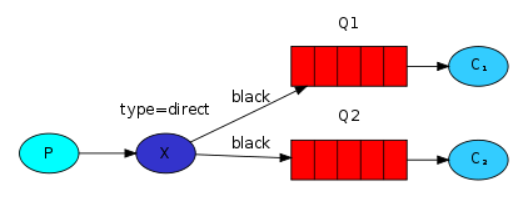

# Architecture

# Specifications

Our logging system from the previous tutorial broadcasts all messages to all consumers. We want to extend that to allow filtering messages based on their severity. For example we may want a program which writes log messages to the disk to only receive critical errors, and not waste disk space on warning or info log messages.\
We were using a fanout exchange, which doesn't give us much flexibility - it's only capable of mindless broadcasting.\

We will use a ***direct exchange*** instead. The routing algorithm behind a direct exchange is simple - a message goes to the queues whose binding key exactly matches the routing key of the message.
