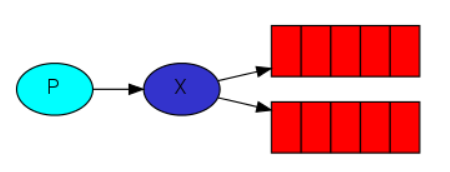

# Architecture

# Specifications
The ***fanout exchange*** is very simple. As you can probably guess from the name, it just broadcasts all the messages it receives to all the queues it knows. And that's exactly what we need for our logger.

