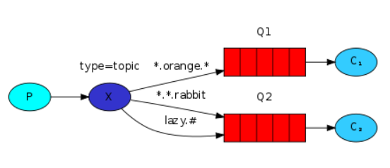

# Architecture

# Specifications
Messages sent to a ***topic exchange*** can't have an arbitrary routing_key - it must be a list of words, delimited by dots. The ***words can be anything***, but usually they specify some features connected to the message.\
 
The binding key must also be in the same form. The logic behind the topic exchange is similar to a direct one - a message sent with a particular routing key will be delivered to all the queues that are bound with a matching binding key.
