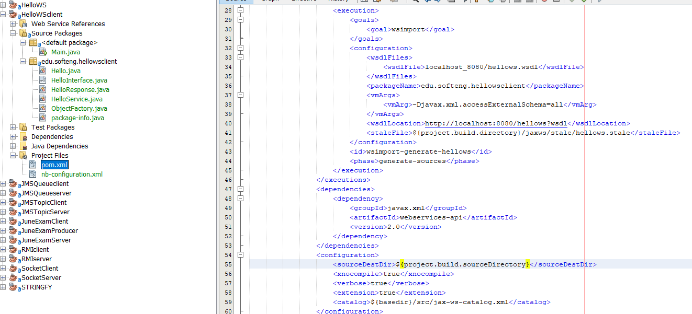

# SOAP

When the client is created, to avoid errors in compilation for duplicate classes, the path must be changed 
`<configuration>` 
    `<sourceDestDir>${project.build.sourceDirectory}</sourceDestDir>` 
`</configuration>`  

The variable used on an implemented class must be PRIVATE

    
    private int id;
    private String title, director, year;

    public Movie(int id, String title, String director, String year) {
        this.id = id;
        this.title = title;
        this.director = director;
        this.year = year;
    }
